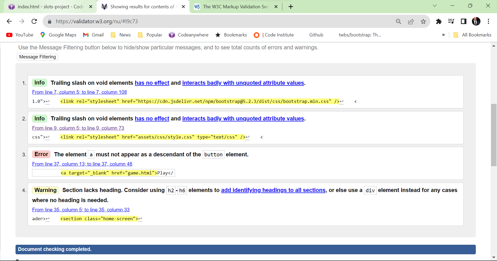

# Slots

## Project Goals

Slots is a memory game that encourages the user to remember a temporarily shown sequence of numbers. The user must key the numbers in the exact sequence that they appeared.

## User Goals

- Play a fun game that challenges the user’s memory.
- Controls are easy to understand.
- Users range from 5 and above.

## Business and Development Goals

- To provide a fun memory game that is easy to play.
- To challenge the memory of users aged 5 and over.

## User Stories

Click  to view the test cases for the user stories.

-	Appealing home page that has a background image of numbers in slots.
-	Navigation bar that features a Home, Instructions, and Feedback.
-	Users will see a "Play" button located in the centre of the page that will take them to the main game.
-	Users can also access the play button via the "Instructions" page.
-	The main game will have the following:
	-	A "New Game", "Submit" and "Continue" button.
	-	4 retangles (slots) in the centre of the screen.
	-	A Score box (to tally the users correct answers)
	-	3 light bulbs (representative of the amount of wrong answers the user can give).
-	The user will first be presented with the "New Game" button that will disappear and start a new game when clicked. 
-	The main game will have 4 slots that will be populated with a random sequence of numbers.  The numbers will be shown for a total of 3 seconds before being hidden.
-	User will repeat the sequence in order of appearance and press the "Submit" button.
-	Users that give a correct answer will receive a message “Congratulations your answer is correct” and 1 point will be added to their score.
-	Users that give the wrong answer will receive the message "You have given the wrong answer" and one of light bulbs will disappear.
-	Once the user acknowledges the message the "Continue" button will appear. On clicking this button users will be able to continue the game.
-	As the user progresses through the game, the time the numbers are shown will decreases, giving the user less time to remember.
-	Once the users light bulbs have all disappeared the game is over and the user will be show a "Game Over" message. 
-	Once the user acknowledges to the message the new game button will reappear.

**User Story Test Case**

-	 Clicking on the “Slots” logo and the Home navigation button will refresh the page. Clicking on the Instructions navigation button will take you to the Instructions page.
-	Clicking on the Feedback navigation button will take you to the feedback page.
-	Pressing the “Play” button will take you the main game.
-	Clicking on the social media icons will transport the user to the Twitter, Facebook and Instagram pages.

**Test Case Instructions Page**

-	On the Instruction the user will see 7 instruction points explaining how to play the game.
-	Below the instructions the user will see a red play button the takes them to the main game.
-	Pressing the Logo, Home, Feedback and Social Media button transports the user to their respective pages.

**Test Case Feedback Page**

-	On the feedback page the user will see an opaque box with a titled question “How Are You Finding Slots?”
-	Beneath the title the user will see the feedback form which they can complete.
-	Beneath the form the user will see a red “Send Request” button. Pressing the button does nothing at this stage but it will be included in the future features.
-	Pressing the Logo, Home, Feedback and Social Media button transports the user to their respective pages.

**Test Case Main Game**

- The user will see and opaque black box with 2 boxes, a green “New Game” button, a score box and 3 light bulbs.
- Clicking on the “New Game” button starts the game generating 2 random numbers in the boxes.
- After 1.5 seconds the number disappear and a the user can now enter the numbers they just saw back in the boxes.
- Once the user enters a number into the first box, the cursor will move on to the next box.
- The user enters the other number and the “Submit” button will appear for the user to press. If it is the correct number, the user is given a message. Correct answer says “Congratulations! That was the correct answer” and will add one point to the score. The “Submit” button is replaced by the continue button and the boxes are disabled.
- Pressing the “continue” button begins a new turn generating 2 more random numbers.
- If the user gives a wrong answer the alert messages says “Unfortunately the correct answer was x and y.” One light bulb is then removed from the window. The boxes are again disabled and the “Continue” replaces the “Submit” button.
- Each time the user gives and incorrect answer a light bulb is removed from the window. When all the light bulbs are gone the user can the game is over.
- When the last answer is given the user is given the message “Game Over” “Play again?”
- If the user presses OK the window is refresh and the user can begin a new game.
- If the player presses cancel the window closes.

## Features

-	### Page Consistency
	-	Each page has the “Slots” header in the top left corner of the page. Clicking on the text transfers the user to the top of the home page.
	-	Tablet users will view the header “Slots” in the top left corner of the page. Clicking on the text will refresh the home page.
	-	Mobile users will view the header “Slots” in the centre of the page. Clicking on the text will refresh the home page.
	-	Navigation Bar
		-	Each page will have a navigation bar containing 3 options Home, Instructions, and Feedback.
		-	On clicking the “Instructions” tab the user will be transported to view instructions on how to play the game.
		-	On clicking the “Feedback” tab the user will be transported a page where they could give feedback on their experience playing the game.
		-	On mobile and tablet devices, users can access the navigation bar via the hamburger icon.
- Users playing on a tablet or mobile devices will interactive via touch screen.
- Users of desktop will use the keyboard.
- #### Home Page
	- Background Image featuring lots of numbers.
	- The "Play" button is located in the centre of the screen.
	- The "Play" button opens a new tab to the main game.
-	#### Instructions Page
	-	Step by step instruction on how to play the game.
	-	Another "Play" button opens tab to the main game.
-	#### Feedback Page
	-	Contact form to be completed by the user to give feedback about their experience with the game.

##	Future Features

-	As user progresses through the game the game generate more slots to memorise.
-	Users will be given the option of a leaderboard.
-	Users will be given a multi-player option.
-	User will be given the option and flash mode (the slot sequences will be random).
-	Bonus points
-	Completion of the feedback form will email the owner directly.

## Typography and Colour

- The font for this application is Roboto which suits the number’s theme of this application.
- Header for Home, Instructions and Feedback pages - background-color: rgba(9, 9, 9, 0.1);
- Footer container for Home, Instructions and Feedback - background-color: rgba(0, 0, 0, 0.1);
- Container for Instructions page - background-color: rgb(0, 0, 0, 0.8);
- Container for Feedback page - background-color: rgba(9, 8, 8, 0.5);
- Font color - #fff and black
- Buttons - rgb(255, 47, 0); rgb(103, 255, 8); rgb(255, 242, 0); rgb(128, 252, 45); rgb(0, 128, 0); rgb(192, 7, 7); rgb(255, 0, 0); rgb(245, 110, 0); rgb(245, 217, 78);

## Wireframes

Click  to view the wireframe images.

## Technology

- [Codeanywhere](https://app.codeanywhere.com/) to build the repository.
- [GitHub](https://github.com/Code-Institute-Org/ci-full-template) to deploy the repository.
- [W3C](https://validator.w3.org/) to validate the HTML and CSS code
- [jslint](https://www.jslint.com/) to validate JavaScript to validate the JavaScript code.
- [w3schools](https://www.w3schools.com/jsreF/prop_text_disabled.asp)
- [MDN web docs](https://developer.mozilla.org/en-US/)
- [Balsamiq](https://balsamiq.com/) for creating the wireframe
- [Font Awesome](https://fontawesome.com/v4/) for the icons
- [Google fonts](https://fonts.google.com/) to search for the right fonts for the website
- [Bootstrap](https://getbootstrap.com/docs/4.6/getting-started/introduction/)  to create forms and buttons.
- Chrome Developer Tools for device testing.

## Testing

- ### Code Validation

	- **HTML**
		- .
		- .
		- .
		- .
	
	- **CSS**
		-	.
		-	.

	- **JavaScript**
		- .
		
	-	**Performance**.
		-	.
		-	.
		-	.
		-	.

-	**Test Cases** - Used Google Chrome Developer Tools to test my website on the below platforms. 
	-	1024 x 1366
	-	390 x 844
Click  for device.testing.pdf
- **Test Procedure**
	- Click  to view the test procedure.
-	**Fixed bugs** - Click to view bugs.pdf

## Deployment

- GitHub: Click to view screenshots.
	1.	Go to [GitHub-Slots Project](https://github.com/2ndborn/slots-project)
	2.	Click on **settings**.
	3.	Scroll down and click on **pages** on the left-hand side.
	4.	Scroll down to **Build and deployment**.
	5.	Where it says **“none”** change to **“main”**.
	6.	Press **“Save”** to deploy to GitHub.

- Click  to view screenshots
	1.	Go to [Codeanywhere](https://app.codeanywhere.com/)
	2.	Workspaces section click on **“2ndborn-slots-project-d85y6w40kn”**.
	3.	Once the page is loaded open a new terminal and type **“python3 -m http.server”**. Then press **Enter**.
	4.	Options to open the preview page or the browser will be shown. Click on the **browser**.
	5.	The browser will open and reveal the web page.

